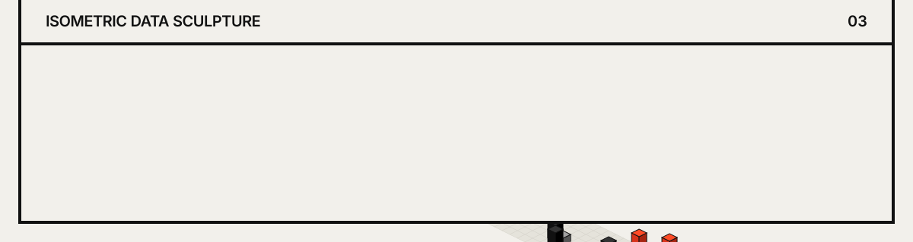
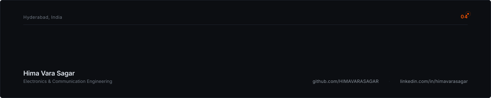

<p align="center">
  
</p>

## Overview

I am an Electronics & Communication Engineering graduate based in Hyderabad, India, working across hardware systems and systems software. My work concentrates on two intersecting domains:

1. **High-Frequency Electromagnetics & Hardware Telemetry** — Terahertz MIMO antenna modeling, resonance frequency tuning via machine learning regression, and low-latency embedded sensor telemetry over UDP.
2. **Systems Software & Intelligent Architectures** — Multi-agent orchestration frameworks (Google ADK), computer vision pipelines, AST-level code analysis tools, and GLSL fragment shaders.

---

## Core Engineering Systems

### Graphene THz MIMO Antenna
*Electromagnetics · 2-Element MIMO · ML Regression · Resonance Tuning*

* Design and parametric analysis of a 2-element terahertz MIMO antenna array utilizing graphene-based radiating patches.
* Investigated mutual coupling reduction techniques and radiation pattern characteristics in the 0.8–1.2 THz frequency band.
* Implemented machine learning regression models to predict resonance frequency shifts and return loss parameters based on physical geometric variations, reducing dependency on computationally expensive full-wave electromagnetic solver sweeps.
* **Tools**: CST Microwave Studio, HFSS, Python (`scikit-learn`, `NumPy`, `SciPy`).

### Universal Cognitive Engine
*Google ADK · Multi-Agent Orchestration · Tool Execution · State Management*

* Multi-agent execution system built with the Google Agent Development Kit (ADK) for structured, multi-step automated workflows.
* Implements deterministic tool dispatch, stateful context persistence across execution steps, and hierarchical agent delegation for complex reasoning tasks.
* Focuses on reproducible tool execution DAGs and rigorous type validation rather than free-form conversational loops.
* **Tools**: Python, Google ADK, Pydantic, Structured Tooling APIs.

### ESP32 Hardware Telemetry Pipeline
*ESP32 · UDP Socket Protocol · Python Ingest · n8n Automation · Thermal Profiling*

* Low-latency embedded telemetry ingestion pipeline built for continuous sensor logging and hardware thermal stress testing.
* ESP32 firmware streams multi-channel sensor packets across local networks via lightweight, low-overhead UDP sockets into an asynchronous Python listener.
* Integrated with local n8n automation instances for threshold detection, automated logging, and real-time state alerts.
* **Tools**: ESP32 (C++ / FreeRTOS), Python (`asyncio`, `socket`), n8n, InfluxDB.

### csage
*Python Engine · PyPI Distribution · Compute Workflows*

* Open-source computational utility library published and maintained on PyPI for structured data operations and automation scripts.
* **Tools**: Python, PyPI packaging standards, Poetry.

---

<p align="center">
  
</p>

---

## Open Source Repositories

Ledger of public source code repositories on [GitHub](https://github.com/HIMAVARASAGAR):

* **[`glsl-fragment-shaders`](https://github.com/HIMAVARASAGAR/glsl-fragment-shaders)** — Procedural graphics routines, raymarching experiments, and mathematical visual shaders grounded in *The Book of Shaders*. Structured as an AI-agent skill for GLSL development.
* **[`wow-gesture-recognition`](https://github.com/HIMAVARASAGAR/wow-gesture-recognition)** — Real-time computer vision gesture recognition pipeline combining Google MediaPipe landmark detection with Hough Transform geometric feature extraction.
* **[`codegraphview`](https://github.com/HIMAVARASAGAR/codegraphview)** — Python Abstract Syntax Tree (AST) analysis tool that parses codebases and constructs dependency graphs and function call hierarchies.
* **[`Soteria`](https://github.com/HIMAVARASAGAR/Soteria)** — TypeScript system utilities and application scaffolding.
* **[`Restaurent_chatbot`](https://github.com/HIMAVARASAGAR/Restaurent_chatbot)** — Interactive conversational booking interface in JavaScript.
* **[`My-Portfolio`](https://github.com/HIMAVARASAGAR/My-Portfolio)** — Personal portfolio source and web layout structure.

---

## Technical Tooling

```
Languages             Python · C++ · TypeScript · JavaScript · MATLAB · GLSL · Bash
Hardware & RF         ESP32 · Microstrip Antennas · Electromagnetic Wave Simulation · UDP Sockets
AI & Systems          Google ADK · Multi-Agent Delegation · MediaPipe · OpenCV · AST Analysis
Automation & Tools    n8n · Git · Linux · Node.js · Satori
```

---

<p align="center">
  
</p>

*Commit activity is synchronized automatically every 12 hours via GitHub Actions ([`.github/workflows/update-readme.yml`](./.github/workflows/update-readme.yml)).*

---

<p align="center">
  
</p>

### Coordinates & Verification

* **Location**: Hyderabad, India
* **GitHub**: [`github.com/HIMAVARASAGAR`](https://github.com/HIMAVARASAGAR)
* **LinkedIn**: [`linkedin.com/in/himavarasagar`](https://www.linkedin.com/in/himavarasagar)
* **Email**: `himavarasagar6675@gmail.com`
